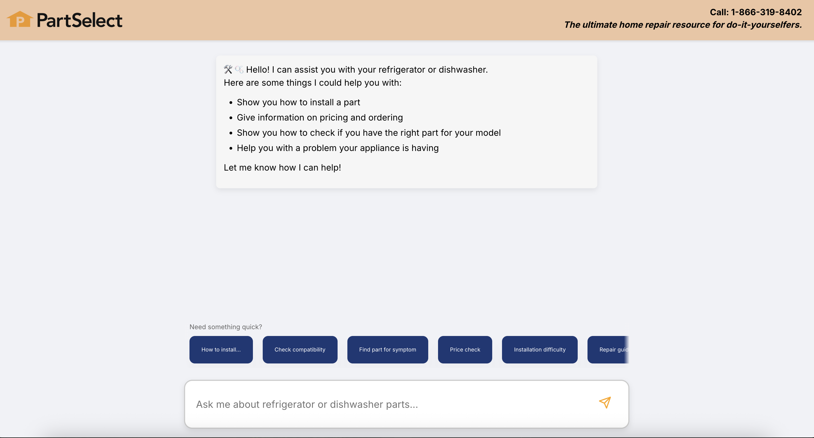
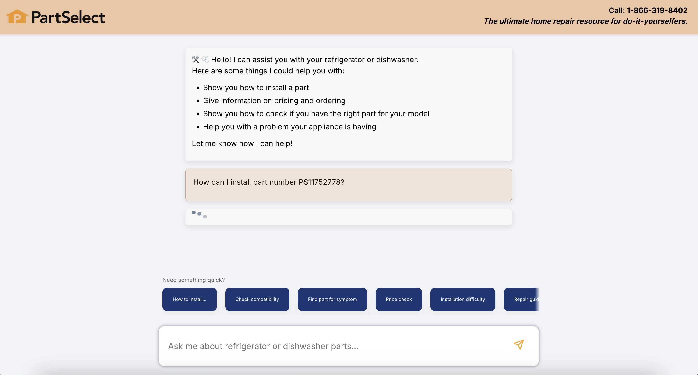
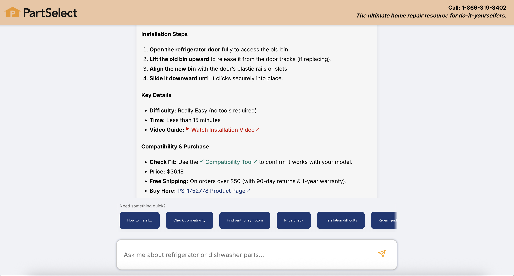
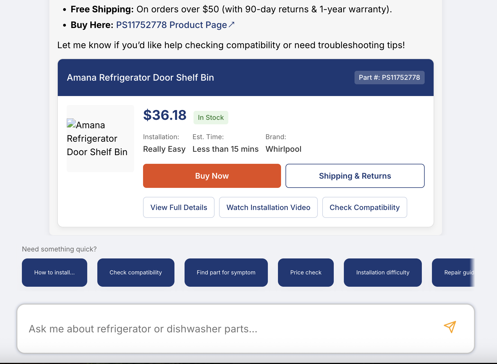

# PartSelect ChatBot

Welcome to PartSelect's refigerator and dishwasher chatbot!

# How to run

To run this chat bot, navigate to the case-study directory.

Add a '.env' file with this:
"DEEPSEEK_API_KEY=xxxxxxxxxxxxxxxxx"

Next, run the frontend with npm start.
And then, run the back npm run start-server.

And that's it! Open http://localhost:3001.

# Techstack and Overview of chatbot
This chatbot uses React (and base HTML/CSS) on the frontend.  The backend is Express.js + Node.js. The database is SQLite.  This chatbot is integrated with DeepSeek's Chat API, and uses Axios to make requests.

# User flow
The user sends a message! And then...
 - the frontend calls getAIMessage() to send user input to server
 - server processes the message (in scope, filtering for part or model numbers, etc)
 - server queries the database, and gives this information as context to LLM
 - server requests DeepSeek
 - server returns DeepSeek's response to frontend

 # ------ Process, Approach, & Challenges -------
Overall idea:
- extract key information and sentiments from user's input
    - what type of request
    - if the request is in the scope
    - if the request contains a part or model #
- query PartSelect Part & Model database based on this
- add this database information to augment the query sent to the model
- generate response from model with new included info

Key Design Choices:
- include video links for installation
- detect and extract part and model #s
- include link to product webpage for compatibility check
- include product card of part when asked to mimic shopping experience (buy now, price, etc)
- Frontend includes short suggested prompts that the user can click to autofill in the input box

Challenges:
- Data: I was able to scrape some data (using bs4, Selenium webdriver, java, puppeteer, axios, etc), but I ran into a 403 error (access denied) a lot.  It ended up not being ample to cover all the things the model should be able to answer, but I was able to find more data online to cover this.

Examples:

